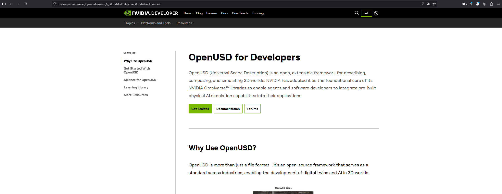
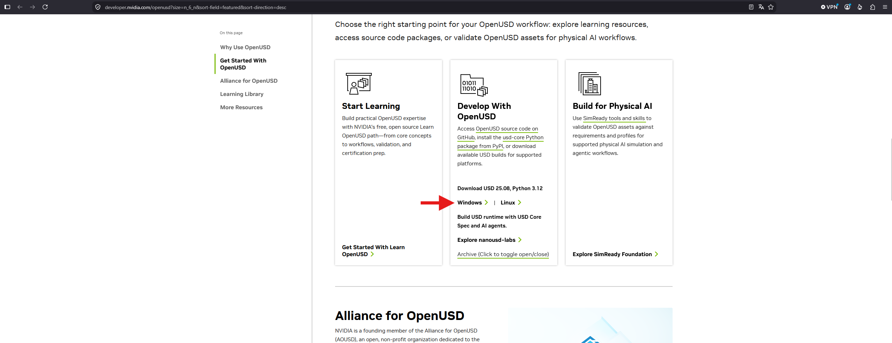
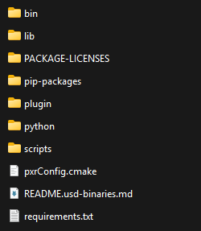
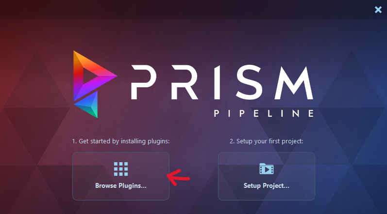
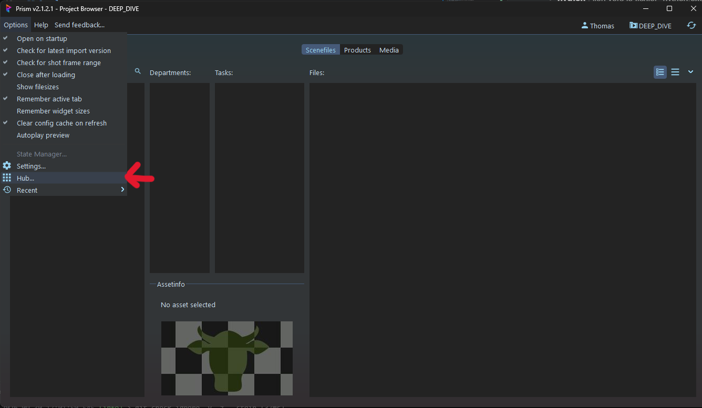
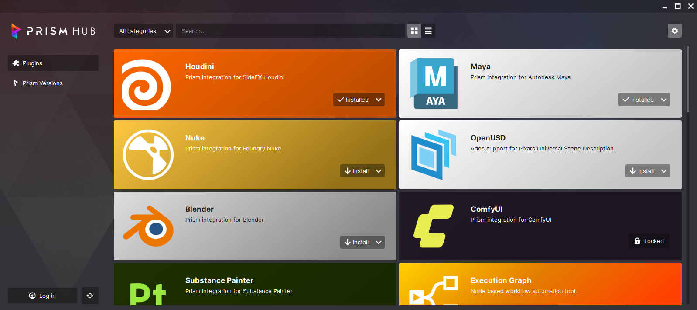
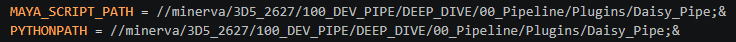
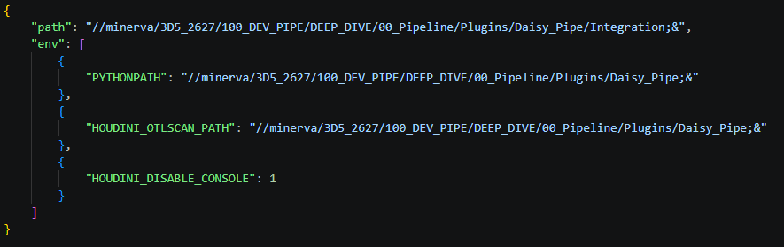

# Installation
[< page précédente](../daisy_pipe.md)
Cette page a pour but de documenter l'installation de l'entièreté du pipeline USD, de la hiérarchie des dossiers aux variables d'environnement de chaque logiciel. Dans cette documentation nous partirons du principe que vous travaillez en équipe sur un réseau local dédié au projet. L'installation de Daisy Pipeline se fait à 2 endroits distincts : le réseau sur lequel vous travaillez et en local sur votre PC. Nous allons vous montrer comment procéder aux 2 endroits. Voici un petit sommaire pour vous aider :

- [Sur le server](#sur-le-server)
    - [Les fondations du pipe](#les-fondations-du-pipe)
    - [Le fichier config.json](#le-fichier-configjson)
- [En local](#en-local)
    - [Les plugins Prism](#les-plugins-prism)
    - [Les variables d'environnement](#les-variables-denvironnement)
    - [usd-core](#usd-core)
    - [Le disque virtuel](#le-disque-virtuel)

## Sur le server
### Les fondations du pipe
L'installation sur le server est la plus importante, elle comprend certes le pipeline USD mais aussi l'ensemble des dossiers dans lesquels ranger vos travaux. Vous trouverez la documentation de cette hiérarchie de dossiers [ici](../overview/hierarchy.md). Nous partirons donc du principe que vous avez la même hiérarchie que celle donnée précédement.

Maintenant que cela est dit, il est temps d'installer Daisy Pipe. Copiez simplement le dossier **"Daisy_Pipe"** dans **PROJET/00_Pipeline/Plugins**.
Puis entrez à l'intérieur. Vous devriez rerouver 3 dossiers : 
- ExternalModules
- Integration
- Scripts

Gardons cet endroit en tête. Il est temps de se rendre sur internet pour aller chercher le code source de l'usd. Vous pouvez y accéder directement via ce lien : [https://developer.nvidia.com/openusd](https://developer.nvidia.com/openusd). Vous arriverez sur cette page.

Descendez pour atteindre la partie "Get Started With OpenUSD" avec 3 rectangles. Seul le rectangle du centre nous intéresse. Clickez sur "Windows" pour télécharger la dernière version du code source d'OpenUSD.

Une fois téléchargé, dézipez le dossier et entrez dedans. Copiez son contenu et retournez dans votre pipe. Entrez dans **ExternalModules/usd_root** et collez le contenu du code source d'OpenUSD. Si vous voulez optimiser un peu la taille de votre pipe, vous pouvez supprimer une partie des dossiers d'OpenUSD pour vous retrouver avec ceci directement dans le dossier usd_root :

### Le fichier config.json
Maintenant que vous avez tout téléchargé et installé il vous reste une étape sur le réseau : le fichier config.json. C'est un fichier qui répertorie les variables principales utilisées dans les scripts du pipe. Vous le retrouverez dans **Scripts/DaisyTools/lib**. Vous deverez le modifier pour qu'il corresponde à votre projet. Voici la liste des paramètres qu'il contient :
- **global** : paramètres globaux du pipe
    - **usd file format** : format des fichiers usd du pipe (en général garder en usdc ou usd pour plus d'optimisation)
    - **sh name digit number** : combien de chiffres composent le nom des shots
    - **max product version** : nombre maximal de versions de products atteignable avant que la popup de suppression de version se déclenche
    - **max scene version** : nombre maximal de versions de scène atteignable avant que la popup de suppression de version se déclenche
- **create usd asset** : paramètres relatifs à la fonction "create USD asset"
    - **autoproxy polygone number** : si vous avez une ModH mais pas de ModL le script create USD asset crée automatiquement une modL à partir de la modH, ce paramètre désigne le nombre de polygones maximum utilisés
    - **variant digit number** : nombre de chiffres dans le nom des variants
- **software** : liens vers les différents logiciels tiers utilisés dans le pipe
    - **hython** : lien vers le fichier "hython.exe" dans les dossiers d'Houdini
    - **usdview** : lien vers "usdview.bat" dans usd_root
- **network** : paramètres relatifs au réseau sur lequel vous avez installé le pipe
    - **UNC path** : chemin UNC vers le dossier qui contient le projet
    - **mapped drive path** : disque virtuel qui pointe vers le réseau (vers le chemin UNC), le sujet sera abordé plus tard sur cette page

En règle générale vous n'aurez qu'à modifier la partie "software" et "network" pour faire fonctionner le pipe.

## En local
Maintenant il est temps d'installer sur votre PC tout ce dont vous aurez besoin pour que le pipe fonctionne, à savoir :
- Prism et ses plugins pour Maya et Houdini
- les variables d'environnement des 2 logiciels
- usd-core
- un disque virtuel qui pointe vers votre réseau

### Prism
Daisy Pipeline est avant tout un plugin pour Prism Pipeline, il est donc essentiel de l'[installer en premier lieu](https://prism-pipeline.com/). Il est aussi nécessaire d'installer certains de ses plugins, à savoir celui de Maya et celui d'Houdini. Voici la marche à suivre ci-dessous.

Commencez par ouvrir Prism. Si c'est la première fois que vous l'ouvrez, vous verrez cette fenêtre. Clickez sur "Browse plugins...".

Si vous l'avez déjà ouvert, vous devrez aller chercher dans "Options / Hub...".

Vous arriverez sur la fenêtre Hub de Prism qui vous permettra de télécharger vos plugins. Attention, il faut vous créer un compte Prism pour les installer.
Suivez les consignes d'installation en prenant soin de cocher les bonnes versions de vos logiciels.

### Les variables d'environnement
Maintenant que Prism est installé, il est temps de lier Daisy Pipeline à Houdini et Maya. Mais comment faire ? Voici un petit tuto.
Nous allons créer des variables d'environnement pour chaque logiciel. **À noter que si vous faites partie de la promo 2026-2027 de l'ESMA Montpellier, vous avez déjà vos variables d'environnement de faites, vous n'avez plus qu'à les copier depuis le réseau 100_DEV_PIPE/00_INSTALLATION vers les dossiers ci dessous**. Néanmoins, vous avez toujours un preset de ces fichiers de disponible.

Maintenant voici où placer les fichiers :
Pour Maya, allez dans **Documents/maya/2026** et remplacez (ou éditez) le fichier **Maya.env**. Voici son contenu :

Pour Houdini, allez dans **Documents/houdini21.0/packages** (remplacez avec la bonne version d'Houdini) et copiez **DaisyPipe.json** dedans. Si le dossier packages n'existe pas, vous pouvez le créer. Voici son contenu :

### usd-core
**Cette section n'est pas nécessaire pour la promo 2026-2027 de l'ESMA Montpellier. La manipulation a déjà été réalisée par les développeurs du pipe.**

### le disque virtuel
**Cette section n'est pas nécessaire pour la promo 2026-2027 de l'ESMA Montpellier. La manipulation a déjà été réalisée par les développeurs du pipe.**

[< page précédente](../daisy_pipe.md)
[page suivante >](daisy_pipe/maya.md)
*Daisy Pipeline 2026 - by Noa Escourbanies, Leeloo Trinh-Thieu and Thomas Rubio*