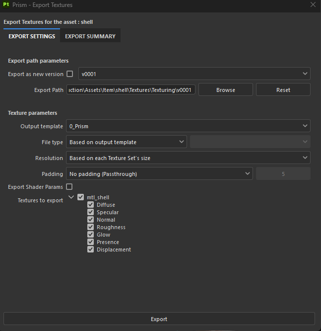
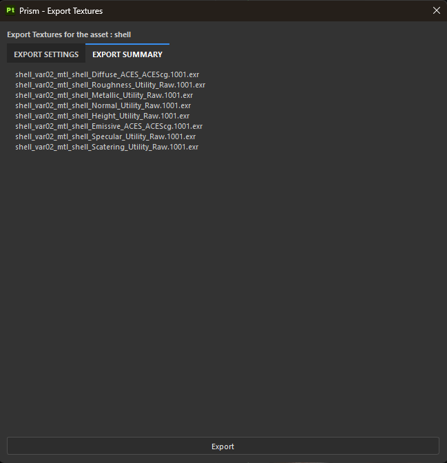

# Exports
[< Page précédente](imports.md)

## Fonctionnement général
Dans Prism > Export textures, vous avez accès à une fenêtre d'export qui remplace la fenêtre d'origine de Substance Painter.

  

## Export Path paramaters
**Le Export Path est rempli automatiquement** afin de diriger vers le bon dossier de stockage de texture pour l'asset. Grâce à un sous-dossier par task, cela permet de ranger séparément les variants de texture et éviter un conflit de texture qui résulte en perte.

De plus, la possibilité de **versionner les textures** permet d'éviter d'écraser les anciennes versions de texture en cas de changement potentiellement destructif. Cependant, il faut tout de même garder en tête le poids des textures et que trop versionner rend le projet très lourd. Et de même, ces nouvelles textures ne se metteront donc pas automatiquement à jour dans les scènes de Shading puisque ce sont de nouveaux fichiers.

Avec l'option **Browse**, vous avez la possibilité de ranger vos textures à un endroit choisi en dehors du pipe mais nous vous conseillons d'exporter au moins une fois vos textures dans le pipe pour qu'elles puissent être retrouvées par Prism pour les autres départements. Si vous avez fait une erreur dans le Path et souhaitez retrouver le Path automatique d'origine, vous avez le bouton **Reset**.

## Texture parameters
C'est dans cette seconde partie que vous allez pouvoir véritablement choisir les maps de textures que vous allez exporter.

**Output template** 
Le **template 0_Prism** est un template par défaut inspiré des templates pour Renderman.
Vous pouvez à tout moment passer dans la fenêtre d'origine d'export de textures de Substance Painter afin de **créer et modifier vos templates** pour les adapter à vos besoins. La fenêtre d'export de ce plugin va chercher directement les templates existants de cette fenêtre d'origine.

**File type, Resolution et Padding** 
Ces éléments de préférence son par défaut basés sur le template et le projet mais vous pouvez à l'echelle globale de vos textures les modifier selon vos préférences.
Les parties grisée de droite sont rendues accessible lorsque le choix fait dans la liste déroulante de gauche ouvre à des choix complémentaires.

**Textures to export** 
A cet endroit ce trouve la liste des materials et les maps qui vont être exportées pour chacun d'eux. Vous pouvez décocher les materials ou maps qui ne vous intéresse pas d'exporter (et ainsi vous éviter dde modifier des templates d'export).

## Export Summary
Tout comme dans la fenêtre d'origine de Substance, vous pourrez voir les noms de  toutes les maps qui vont être exportés.

  

[< Page précédente](imports.md)
[Page suivante >](development.md) 
*Daisy Pipeline 2025 - by Noa Escourbanies, Leeloo Trinh-Thieu and Thomas Rubio*