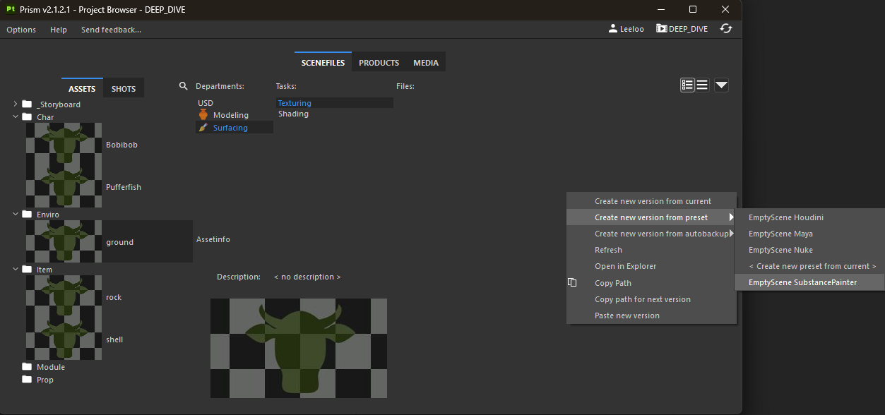
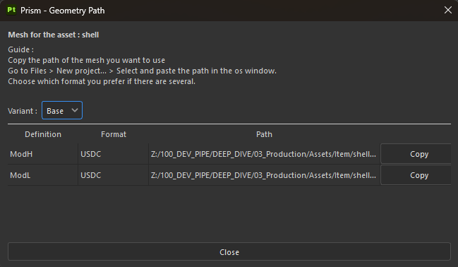
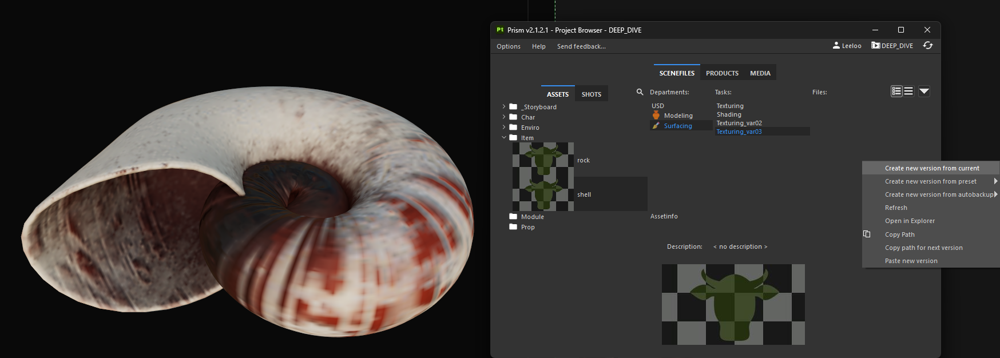
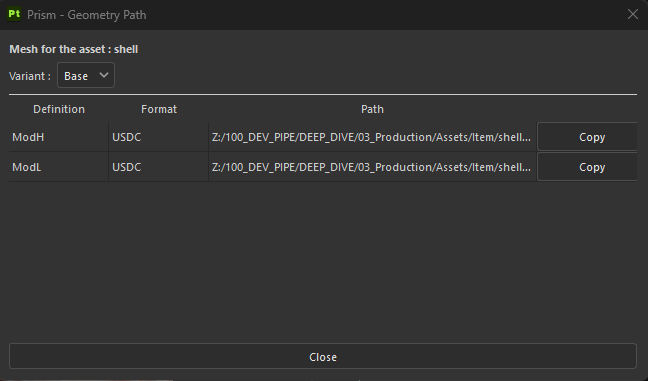

# Imports
[< Page précédente](installation.md)

## Nouvelle scène de Texture
Pour créer une scène de travail Substance Painter, il suffit d'ouvrir le logiciel, une fenêtre Project Browser de Prism s'ouvre automatiquement.
Sélectionnez l'emplacement de la scène voulue (asset, département et task) et faites un clic droit. Sélectionnez **Create new version from preset > EmptyScene SubstancePainter**

Une **fenêtre Geometry Path** apparaît vous permettant de copier le path des publish de modélisation liés à votre asset. Cela inclu les ModL, ModH ainsi que les différents variants grâce à un menu déroulant si vous utilisez également le Daisy-Pipeline en USD.

Il vous suffit ensuite d'aller dans **File > New Project...** et de coller ce chemin pour retrouver votre mesh. Vous êtes entièrement libre de choisir les paramètres de projet que vous souhaitez pour votre texturing.

Il vous suffit de faire un **Ctrl+S** afin que votre scène se nomme et se range automatiquement correctement dans votre pipeline.
   
## Nouvelle scène de Texture à partir d'une scène existante
Si vous souhaitez dans une nouvelle task, reprendre une scène d'une autre task et y faire des modifications (notamment dans le cadre de variants de texture), c'est très simple.
- Ouvrez la scène de texture source que vous souhaitez copier.
- Ouvrez votre Project Browser (Prism > Project Browser)
- Dans votre nouvelle task, faites un clic droit et cliquez sur **Create new version from current**.
- Substance Painter ouvre automatiquement la nouvelle scène créée à l'identique à partir de la scène source.

  

## Geometry Path
Si vous avez malencontreuseument fermé la fenêtre de Geometry Path, vous pouvez la retrouver dans Prism > Geometry Path
Cette fenêtre peut également se retrouver utile si vous souhaitez texturer une version lowpoly de votre asset mais récupérer sa version highpoly afin de baker les maps de texture.

  

[< Page précédente](installation.md)
[Page suivante >](exports.md) 
*Daisy Pipeline 2025 - by Noa Escourbanies, Leeloo Trinh-Thieu and Thomas Rubio*