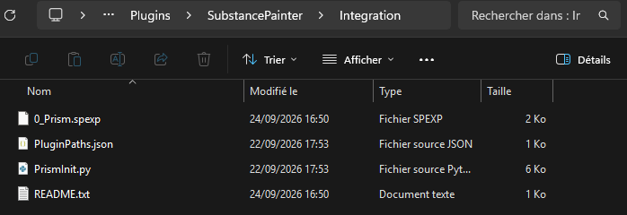
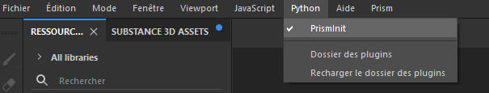

# Installation
[< Page précédente](../substancepainter.md)
## Etapes :
I. Copiez le dossier de plugin Substance Painter dans votre **ProjetPrism/00_Pipeline/Plugins**
   
   

II. Dans ce dossier de plugin SubstancePainter/Integration:

- Copiez le fichier **0_Prism.spexp** et collez-le dans **Utilisateur/Documents/Adobe/Adobe Substance 3D Painter/assets/export-presets**
   
- Copiez le fichier **PrismInit.py** et collez-le dans **Utilisateur/Documents/Adobe/Adobe Substance 3D Painter/python/plugins**
   
- Copiez le fichier **PluginPaths.json** ou alors ajoutez la ligne ci-dessous au fichier déjà existant à cet emplacement **C:\Users\3D5\Documents\Prism2**
  > **{"path": "Z:\\ProjetPrism\\00_Pipeline\\Plugins\\SubstancePainter"}**
  >> Adaptez le début du chemin à l'emplacement local de votre projet/plugin

   
   
III. Ouvrez Substance Painter, dans l'onglet **Python**, cochez **PrismInit**

  
### Installation Réseau
Actuellement, le plugin est fonctionnel en réseau uniquement sur le réseau du campus de l'ESMA de Montpellier. Une amélioration est en cours pour généraliser ce fonctionnement.

[< Page précédente](../substancepainter.md)
[Page suivante >](imports.md) 
*Daisy Pipeline 2025 - by Noa Escourbanies, Leeloo Trinh-Thieu and Thomas Rubio*