# Modeling
[< page précédente](../departments.md) 
Commençons par définir les shapes de nos assets. Nous allons nous attaquer à 2 types de modé : la modé low (ModL) et la modé high (ModH). La ModL servira de proxy dans nos futurs fichiers USD, il est donc important qu'elle soit la plus simple et légère possible. La ModH quand à elle sera la modé qui sera affichée au rendu (donc aussi celle qui sera texturée et shadée). 
Alors comment gérer ce département par logiciel ?

- [Prism](#prism)
- [Maya](#maya)
- [Houdini](#houdini)

## Prism
Commençons par Prism, nous allons voir comment créer un nouvel asset puis une nouvelle scène Maya (on utilisera le même procédé pour Houdini).

Tout d'abord, commençons par créer un asset. Si vous faites un **click droit dans le panneau "Assets"** vous verrez apparaitre une popup. Choisissez "**Create Asset**" pour créer un asset, vous pouvez faire apparaitre cette même popup en faisant un **click droit sur un dossier** pour que certains paramètres soient remplis automatiquement.

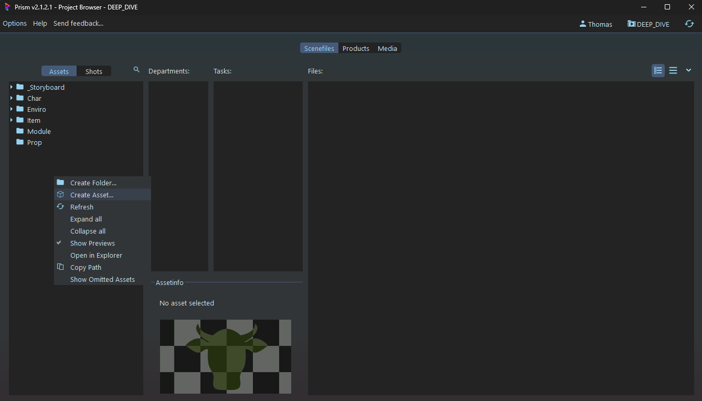

Une fenêtre s'ouvre, elle vous permet de définir les paramètres de votre asset. Dans cet exemple nous allons créer une algue dans le dossier "Prop". Nous allons donc nommer l'asset "algae", son dossier se définit comme un chemin, ici ça sera donc "**Prop/algae**". On peut aussi définir une thumbnail et un preset de tasks, ici "**Prop**" (qui peuvent être crées ultérieurement, pas de panique). Puis on click sur "**Create**" pour valider.

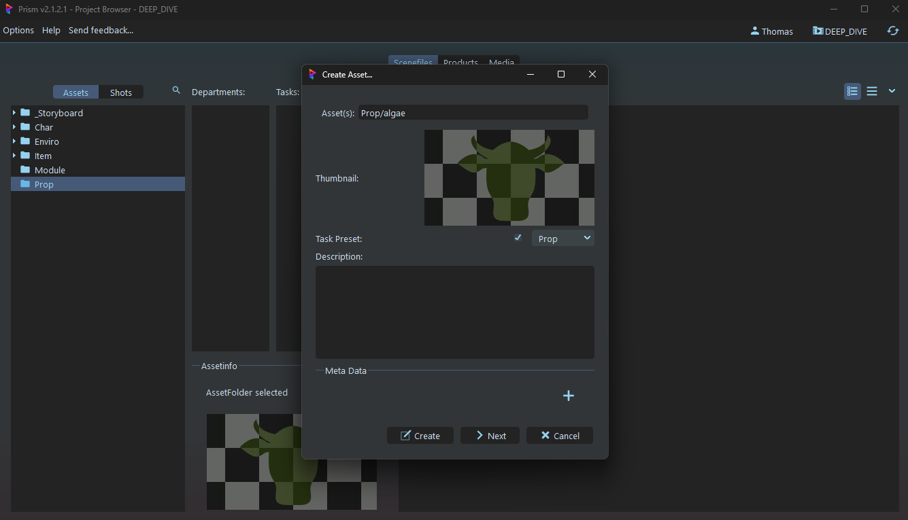

Maintenant que notre asset d'algue est créé il est temps d'ajouter une scène de ModL. Ici nous créerons une scène Maya en faisant un **click droit dans "Files"** puis en allant sur "**Create New Version From Preset**" et "**EmptyScene Maya**".

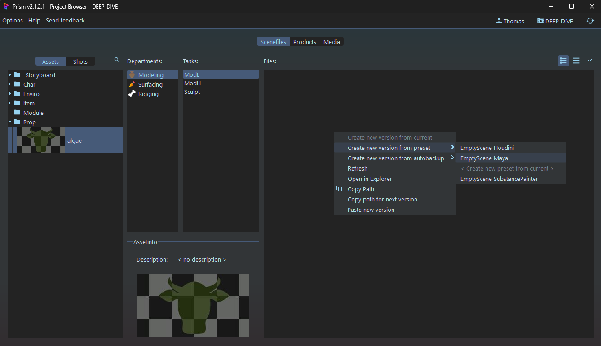

La manipulation fonctionne de la même manière pour Houdini ou n'importe quel autre logiciel associé avec Prism via un plugin.

## Maya
Il est maintenant temps d'ouvrir notre scène Maya fraîchement créée. Alors lancez Maya (vous pouvez aussi clicker sur la scène dans Prism mais c'est assez instable). Quand Maya s'ouvre, une fenêtre Prism devrait s'ouvrir aussi, **double clickez sur la scène que vous voulez ouvrir** et vous pouvez enfin modéliser.

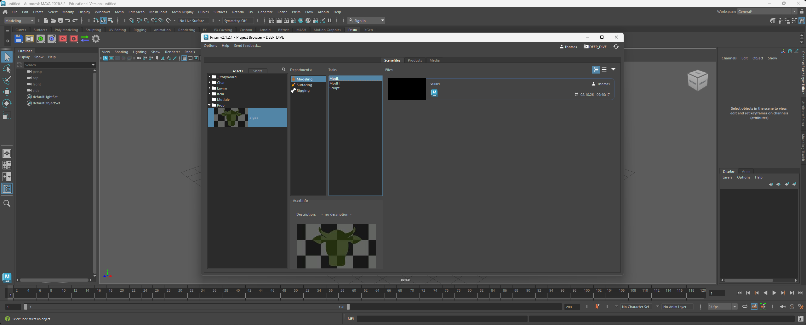

Maintenant que notre ModL d'algue est prête, il est temps de l'exporter en USD. Pour ça il va falloir ouvrir le **State Manager**. Vous pouvez y accéder dans le menu Prism ou dans la shelf Maya prévue pour Prism (le logo avec les flèches verte et bleue). 
Cette fenêtre sert aux imports et aux exports, vous pouvez faire des listes de choses à exporter en même temps (par exemple : une animation en usd, un playblast et un script), ici nous l'utiliserons pour exporter notre ModL. Nous allons donc **clicker sur "Export"** et choisir "**DaisyUsdExport**" (ou DaisyGeoExport pour exporter en fbx ou obj).

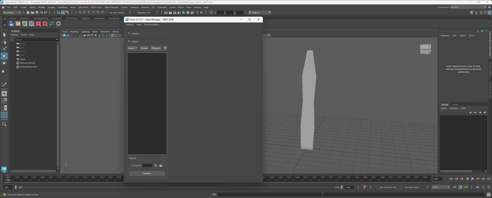

À droite vous retrouvez les paramètres d'export. Ce qu'il faut avant toute chose c'est **sélectionner votre mesh** ou vos meshs et **clicker sur add selected** pour les ajouter à l'export. 
> Vous remarquerez que vos mesh ont étés placés dans des goupes et que nous avons créé un selection set, ils sont nécessaires au reste du pipe donc il ne faut pas y toucher.

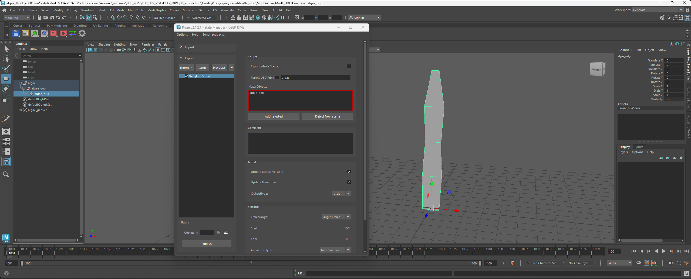

Vous pouvez ajouter un commentaire, une description et une image de preview si vous le souhaitez. 
Vous pouvez modifier certains paramètres de l'usd mais nous vous conseillons de ne pas y toucher. 
Il est aussi possible d'exporter les UVs ainsi que la méthode de subdivision (qui est en Catmull-Clark automatiquement) 
Finalement vous pouvez exporter une animation avec le State Manager mais nous y reviendrons dans un chapitre dédié.

Maintenant vous pouvez exporter en **clickant sur "Publish"** ou en faisant un **click droit sur "DaisyUsdExport"** et en choisissant "**Execute**". 
Bravo, vous avez exporté votre première géo.

Une dernière chose : maintenant que nous avons fini notre ModL, il est temps de passer à la ModH. Mais comment récupérer la ModL pour créer la ModH ? 
Tout simplement en dupliquant la scène ! Rendez-vous dans le **Project Browser** (la fenêtre Prism) à l'intérieur de Maya, mais gardez bien votre scène ouverte. Puis **allez dans la task ModH** et faites un **click droit dans "Files"** sélectionnez "**Create new version from current**". Votre scène est maintenant dupliquée dans ModH, pous pouvez travailler dessus et recommencer le processus d'export.

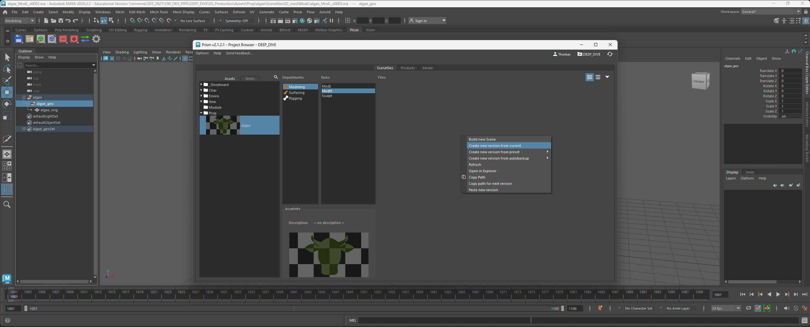

***

## Houdini
Pour commencer votre modé dans Houdini, commencez par créer un nouveau projet (comme pour Maya au dessus), puis ouvrez Houdini et sélectionnez le projet. Vous arriverez sur cette fenêtre.

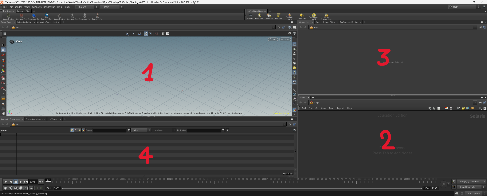
1. Le viewport
2. Le node editor
3. Les parameters
4. Le scene graph tree

Tout d'abbord, assurez-vous que vous êtes bien dans le **contexte "Stage"** (Solaris). Vous pouvez le voir via le logo orangé en haut du node editor. Pour plus de confort je vais modifier l'organisation des fenêtres (mais ça ne change rien, pas de panique).

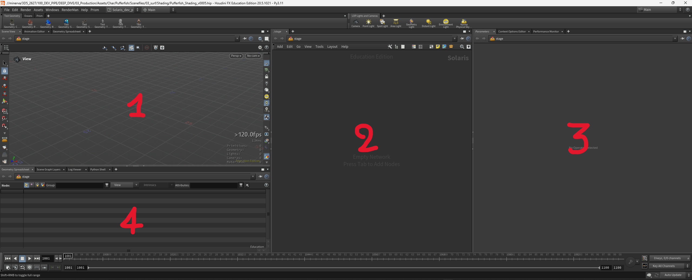

Maintenant que Houdini est prêt à être utilisé, il est temps de créer le template de modeling (un template général, rien de très spécifique au département). Mais comment faire ? Créez un nouveau node **en appuyant sur TAB ou en faisant un click droit** dans le node editor et cherchez le node "**Create template**" rangé dans "Daisy Pipe". Puis dans les paramètres du node **clickez sur le bouton "Create template"**. 
Magie !!! Un template est créé. Il peut prendre 2 formes : 
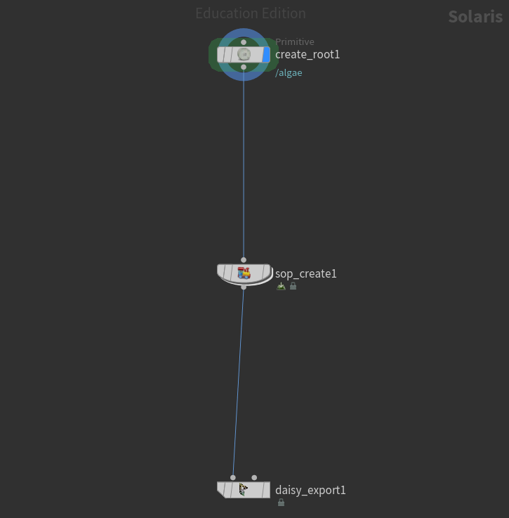
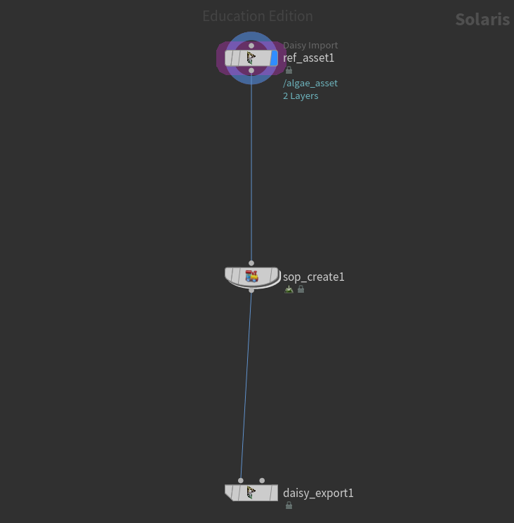 
Chaque forme se crée en fonction de la présence ou non d'un export USD de la task active. Et en français ? Par exemple, ici je suis dans la task ModL_var02, mais c'est la première fois que je crée ma modé, donc j'aurai la première forme. Mais si j'ai déjà fait un export dans cette task, j'aurai la seconde forme qui importe l'asset USD global (que nous verrons plus tard).

Si vous n'avez pas compris le paragraphe du dessus, c'est pas grâve. Dans tous les cas, l'endroit où vous allez travailler sera le second node : le "**sop create**". Pour commencer votre modé, vous pouvez rentrer dedans en **double clickant dessus**. Et je vous souhaite bon courage pour votre modé.

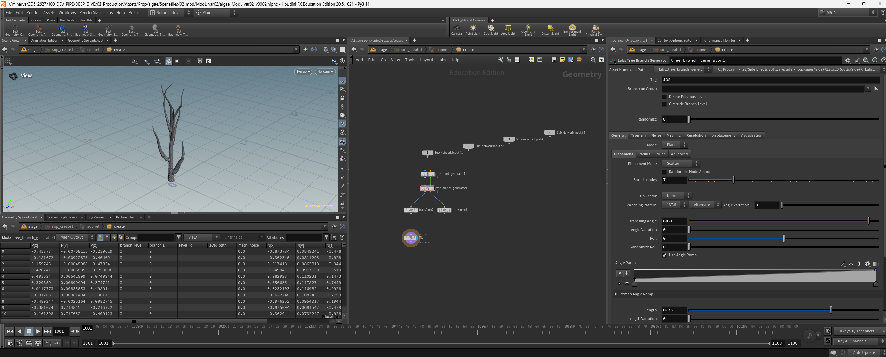

Une fois votre modé terminée, vous pouvez l'exporter. Assurez-vous qu'elle est bien placée dans ce type de hiérarchie : /\<asset\>/\<asset\>_geo/\<mesh\>

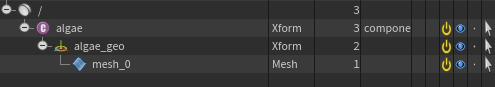

Puis **allez sur le node "daisy export"** et clickez sur "**save to disk**". Voilà, votre modé est exportée en USD.

Finalement, comme pour Maya : maintenant que nous avons fini notre ModL, il est temps de passer à la ModH. On peut créer un nouveau fichier de ModH à partir de la modL ? 
Rendez-vous dans le **Project Browser** (la fenêtre Prism) à l'intérieur d'Houdini, mais gardez bien votre scène ouverte. Puis **allez dans la task ModH** et faites un **click droit dans "Files"** sélectionnez "**Create new version from current**". Votre scène est maintenant dupliquée dans ModH, pous pouvez travailler dessus et recommencer le processus d'export.

[< page précédente](../departments.md)
[page suivante >](texturing.md) 
*Daisy Pipeline 2026 - by Noa Escourbanies, Leeloo Trinh-Thieu and Thomas Rubio*