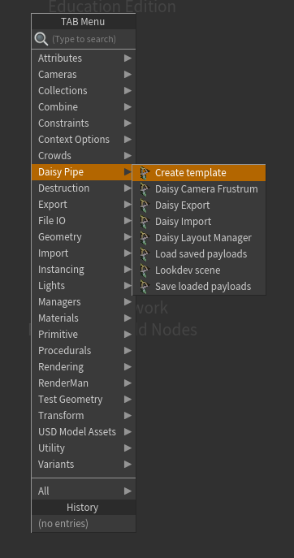
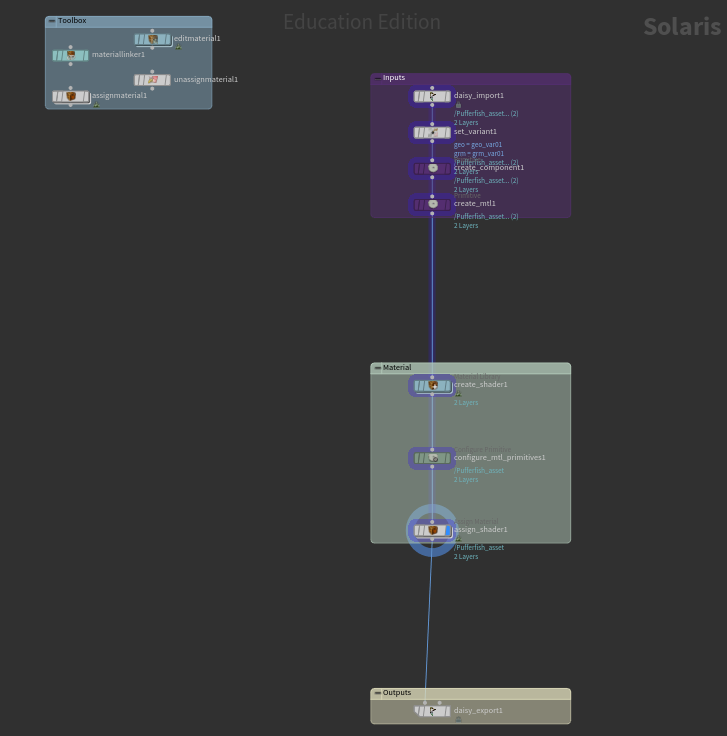
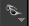
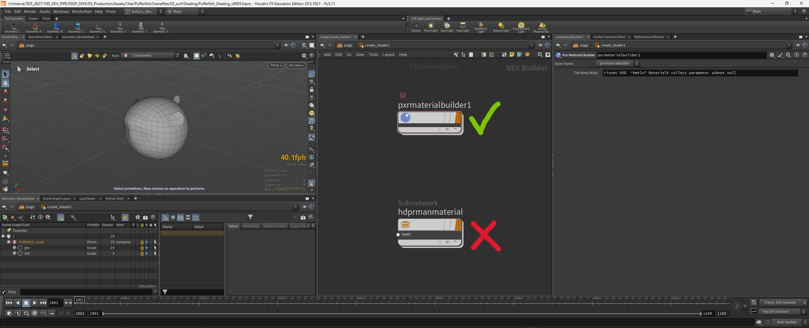
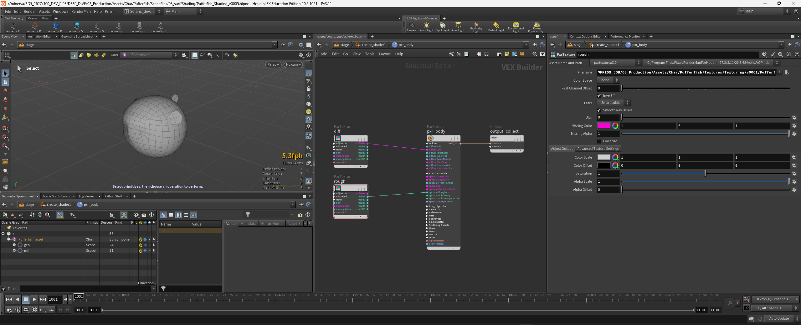
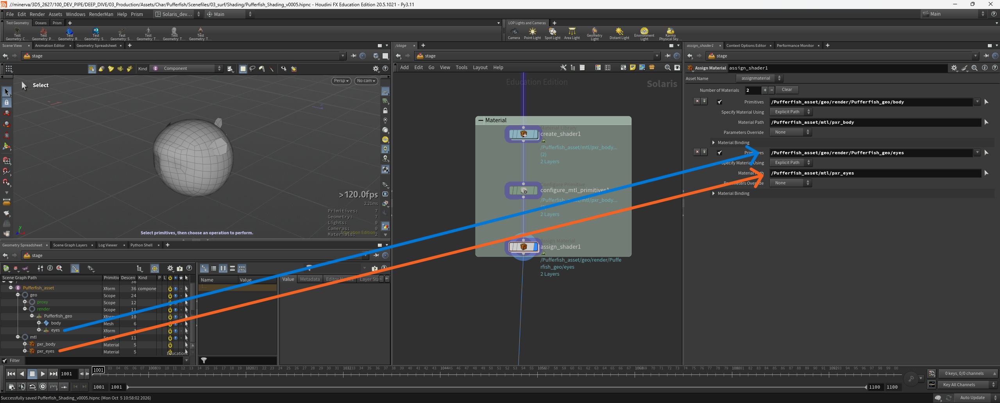
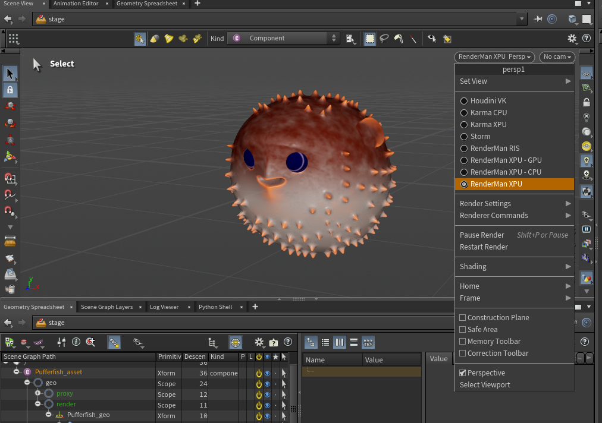
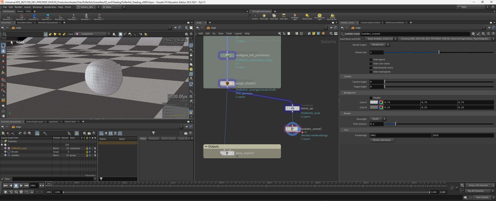
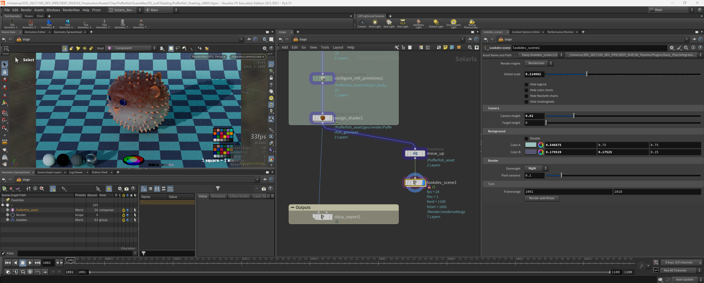
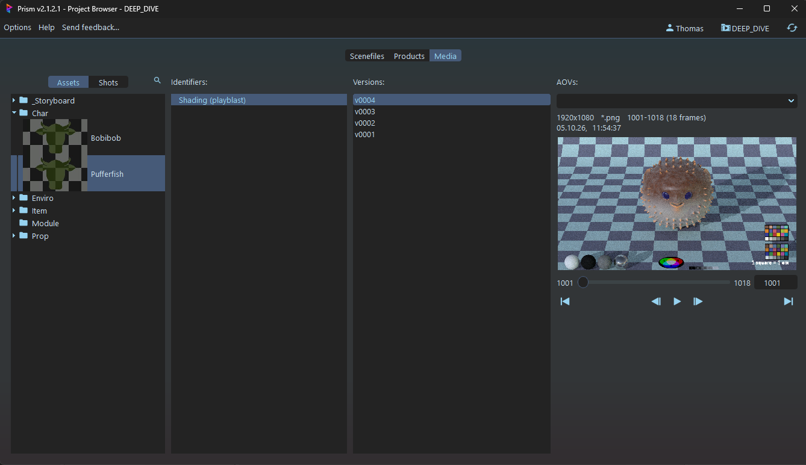

# Shading
[< page précédente](../departments.md) 
Ok, Maintenant que nous avons un asset texturé, il est temps de lui créer un shaderdans Houdini. "Quoi ?!" me direz-vous "Mais je ne connais pas Houdini ! Comment je vais faire ?! Suis-je condamné aux méandres de l'incompréhension et du désespoir ?!". Pas de panique, on va vour tout ça ensemble, étape par étape, et vous allez voir que ça ressemble plus à Maya que ce que vous pouvez croire.

- [Création du template](#création-du-template)
- [Présentation du template](#présentation-du-template)
- [Création des shaders](#création-des-shaders)
- [Scène de lookdev](#scène-de-lookdev)

***

## Création du template
Tout d'abbord, ouvrez Houdini. Avec le Project Browser créez un nouveau fichier dans la task "Shading", puis ouvrez-le. Vous devriez vous retrouver avec une configuration similaire à celle-ci :

1. Le viewport
2. Le node editor
3. Les parameters
4. Le scene graph tree

Tout d'abbord, assurez-vous que vous êtes bien dans le **contexte "Stage"** (Solaris). Vous pouvez le voir via le logo orangé en haut du node editor. Pour plus de confort je vais modifier l'organisation des fenêtres (mais ça ne change rien, pas de panique).

Il est temps de se lancer dans notre shading. Pour ce faire, nous allons créer un template de nodes que vous pourrez utiliser à volonté. Alors, placez-vous dans le node editor et faites **TAB (ou click droit)**. Un menu s'ouvre pour choisir votre node, si vous avez bien fait votre installation, vous devriez avoir un **catégorie "Daisy Pipe"**. Choisissez le node "**Create template**" et clickez pour le placer.

Votre node est créé, dans les parameters vous avez un bouton "create template" sur lequel vous pouvez clicker. Magie ! Un template s'est créé tout seul.

Avant de modifier le template il est important de savoir que si un node est de la même couleur que son backdrop, il vaut mieux éviter d'y toucher. Notons également qu'il y a un backdrop en haut à gauche nommé "Toolbox", c'est un répertoir de nodes qui pourraient vous être utils (ou pas), à vous d'explorer et les tester. Maintenant passons en revue les nodes qui composent le template.

***

## Présentation du template
1. **Dans le backdrop "Inputs"** sont rangés les nodes qui servent à l'import de votre asset et à la création de votre hiérarchie de primitives.
    - daisy import : Import l'asset sélectionné
    - set variant : si vous avez plusieurs variants de geo ou de groom, vous pouvez choisir ici sur lequel travailler
    - create component : passe le kind de la primitive principale en "component"
    - create mtl : ajoute une primitive "mtl" pour ranger vos shaders
2. **Le backdrop "Materials"**, c'est là que vous travaillerez votre shading.
    - create shader : c'est là que vous aller gérer vos shaders (nous en reparlerons plus tard)
    - configure mtl primitives : s'assure que les primitives créées soient bien de type "material"
    - assign shader : permet d'assigner chaque shader à la bonne primitive
3. **Le backdrop "Outputs"** qui sert à exporter votre shading en USD
    - daisy export : permet d'exporter les shaders en usd

***

## Création des shaders
Maintenant que nous avons fait les présentations, passons à la pratique. Il est temps de créer nos shaders. Pour cela nous allons utiliser notre asset "pufferfish". Rentrez dans le node "**create shader**" en double clickant dessus.

> Petit tip, vous pouvez passer de la vue "proxy" à la vue "render" en clickant sur les lunettes à droite du viewport. 
>

Nous allons créer un "Material builder", c'est à dire un conteneur qui encapsule les shaders comme le PxrSurface. Il existe 2 types de material builder pour Renderman dans Solaris :
- Prx Material Builder
- Renderman Material Builder (Hydra)

Je ne rentrerai pas dans les détails techniques mais je vous conseil de choisir le premier. Il vous faudra 1 material builder par shader. Ici nous allons en créer 2, un pour le corps et un pour les yeux. Pensez bien à les renommer.

Puis entrez dans votre material builder. Vous arrivez sur un node "output collect", c'est sur lui que vous allez connecter votre PxrSurface (ou autre shader). Puis créez votre shader comme vous le feriez dans Maya, ce sont exactement les mêmes nodes (à 2 ou 3 exceptions près pour des cas très spécifiques).

Une fois que vous avez créé vos shaders, il est temps de les assigner. Allez sur le node "assign shader". Pour assigner votre material, faites un drag and drop de la primitive que vous voulez assigner (depuis le scene graph tree) vers le paramètre "Primitives" (ou tapez son chemin à la main). Faites de même avec la primitive du shader dans "mtl" que vous devez faire glisser dans "Material Path".

Si vous voulez ajouter plusieurs shaders, pas besoin de créer un nouveau node. Clickez simplement sur le "+" de "Number of Materials" en haut des paramètres ou à côté de votr premier material (vers la petite croix rouge).

> Notez que vous pouvez assigner des groupes entiers (c'est ce que j'ai fait pour les yeux, j'ai ajouté le group "eyes" qui contient les 2 geo des yeux) 
> Vous pouvez aussi utiliser des expressions si vous le souhaitez mais vous en aurez surtout besoin dans d'autres départements

Je tiens à vous féliciter, parce que depuis le début de ce tuto vous travaillez à l'aveugle. Eh oui, ça serait pratique de pouvoir voir ce qu'on fait. Si vous voulez voir le résultat de votre shading vous pouvez activer l'IPR de Renderman. Mais comment faire ? 
Allez en haut à droite du viewport et ouvrez le menu indiquant "Persp" et choisissez votre moteur de rendu (le premier rendu devrait prendre un peu plus de temps).

***

## Scène de lookdev
Il est finalement temps de vous présenter un petit outil que j'ai créé et qui peut vous être utile. Allez chercher le node "Lookdev scene" dans "Daisy Pipe" et connectez le à la sortie du node "assign shader".

Ce node vous crée automatiquement une scène complète pour voir votre shading. Il vous permet aussi de faire un turn automatique de votre asset. Il y a plusieurs paramètres que vous pouvez modifier.
- le moteur de rendu
- le scale global pour mettre la scène à l'échelle de l'asset
- la possibilité de cacher certains éléments de l'interface
- la hauteur de la caméra
- la hauteur du target de la caméra
- les couleurs du background
- le type de domelight : Studio, Day, Night et Custom (où vous pouvez mettre un HDR custom, changer la couleur et l'intensité de la light)
- le pixel variance pour gérer les samples
- le framerange du turn

> Sachez que le turn se fait en 2 parties égales, une fois avec l'asset qui tourne et une fois avec la light qui tourne. 
> Vous ne pourrez pas changer la durée de chaque partie, seulement la durée global

> Si le turn ne se met pas à jour, n'hésitez pas à modifier le framerange et le remettre pour le refresh

Pour lancer le turn clickez sur le bouton "Render with Rman" (ou Karma), ce qui lancera le rendu d'une animation en local. Donc pensez bien à jouer avec le pixel variance et ne pas faire un turn trop long si vous ne voulez pas que le rendu dure trop longtemps.

Le turn est ensuite stocké dans Prism sous forme d'une séquence d'images dans les playblasts de votre asset.

[< page précédente](../departments.md) - 
[page suivante >](set_dress.md) 
*Daisy Pipeline 2026 - by Noa Escourbanies, Leeloo Trinh-Thieu and Thomas Rubio*