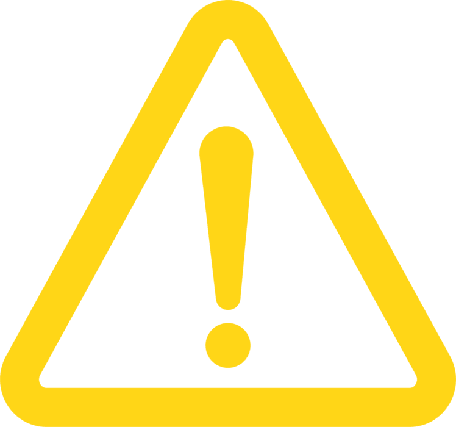
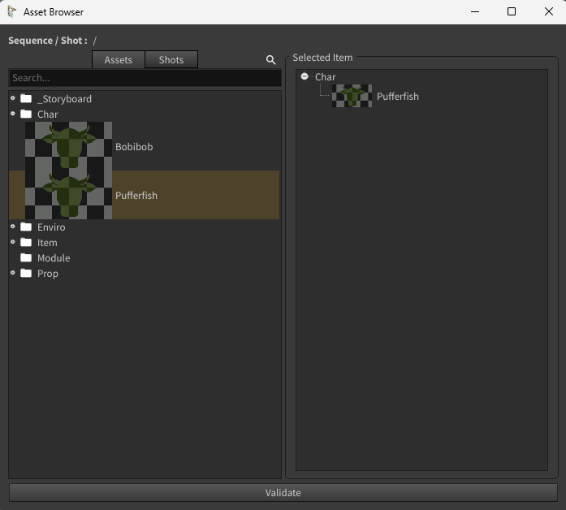
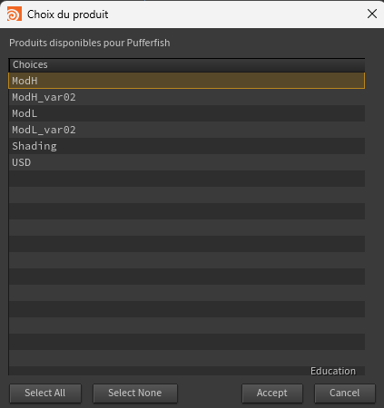

# HDA
[< page précédente](../houdini.md) 
Cette page sert à lister les HDA (c'est à dire les nodes custom) de Daisy Pipe. Ils sont accessibles dans le TAB menu d'Houdini mais uniquement dans le contexte de Solaris (stage). En voici la liste :

- [Create template](#create-template)
- [Daisy Import](#daisy-import)
- [Daisy Export](#daisy-export)
- [Lookdev scene](#lookdev-scene)
- [Daisy layout manager](#daisy-layout-manager)
- [Daisy camera frustrum](#daisy-camera-frustrum)
- [Save loaded paloads](#save-loaded-payloads)
- [Load saved payloads](#load-saved-payloads)

## Create template
Ce node permet de créer un template pour chaque task de la production. Il est très simple d'utilisation : créez le node, clickez sur le bouton "Create template" et c'est fini.

> 
> Il est important pour le bon déroulement des scripts d'avoir une scène vide, sans aucun node existant. Si vous avez des nodes avant de créer le template, ils risquent de rentrer en conflit les uns avec les autres et de perturber le placement du template.

## Daisy Import
Voici un node que vous allez utiliser très souvent. Il permet d'importer la dernière version d'un product depuis Prism. Voici comment l'utiliser : 
Clickez sur le bouton "**Browse Asset**", une fenêtre s'ouvre, c'est l'Asset Browser. Cette fenêtre vous permet de choisir un asset à importer. Faites un **drag and drop de l'asset** que vous voulez importer dans la colonne de droite et clickez sur "**Validate**".

Une autre fenêtre s'ouvre pour choisir cette fois-ci le product que vous voulez importer. **Sélectionnez-le** et clickez sur "**Accept**". Voilà, c'est importé.

Ci dessous la liste des paramètres du node :

|Nom du paramètre|Description
|:---|---:
|Import as|Permet de choisir entre 2 méthodes d'import, la référence ou le sublayer
|Show path|Affiche le chemin d'import et permet de le modifier manuellement
|**Advanced Settings**|
|Layer break|Active un node de layer break qui permet d'ignorer tout ce qui se passe avant en créant un nouveau sublayer
|Maya scale|Adapte la taille des assets qui viennent de Maya pour les faire correspondre à l'échelle d'Houdini
|Load payloads|Permet d'activer le node [Load saved payloads](#load-saved-payloads) décrit dessous
|Use geometry sequence LOP for file sequences|Active l'import de séquence d'USD pour importer une animation
|Has variant|Si votre asset a un ou des variants, cette case ajoute de nouveaux paramètres pour choisir vos variants
|Uniform scale|Si la case "Maya scale" est cochée, permet de modifier l'échelle de l'asset
|Import path prefix|

## Daisy Export

## Lookdev scene

## Daisy layout manager

## Daisy camera frustrum

## Save loaded payloads

## Load saved payloads

[< page précédente](../houdini.md)
[page suivante >](../prism.md) 
*Daisy Pipeline 2026 - by Noa Escourbanies, Leeloo Trinh-Thieu and Thomas Rubio*