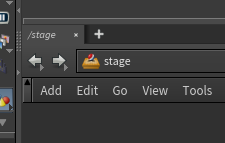
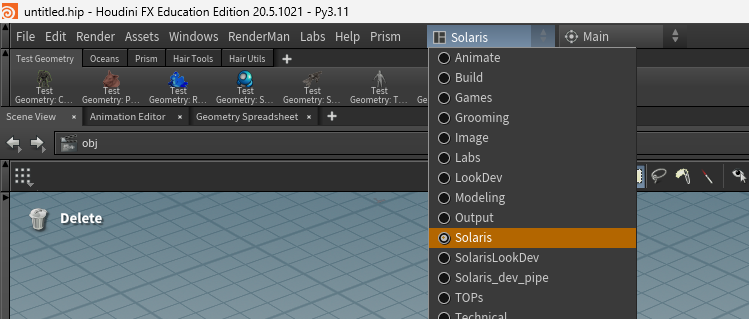
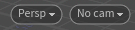
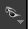
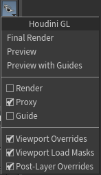
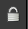
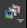

# Solaris
[< page précédente](../houdini.md)

Cette page est une introduction à Solaris, le contexte Houdini qui sert à gérer l'USD. Ici nous partirons du principe que vous avez déjà les bases de l'USD. SI vous avez besoin de plus d'informations à ce sujet, vous pouvez vous rendre sur la [page de la doc dédiée à l'USD](../../overview/usd.md). 
Ce document est un peu long donc voici un sommaire de la page pour aller directement à la partie qui vous intéresse :

- [Solaris, qu'est-ce que c'est ?](#solaris-quest-ce-que-cest-)
- [Le viewport](#le-viewport)
- [Le Scene Graph Tree](#le-scene-graph-tree)
- [Le Scene Graph Layers](#le-scene-graph-layers)
- [Les nodes utils](#les-nodes-utils)

***

## Solaris, qu'est-ce que c'est ?
Tout d'abord, il faut savoir qu'houdini fonctionne en "**contextes**". "Mais qu'est-ce qu'un contexte ?" me demanderez-vous. Un contexte est une section d'Houdini spécialisée dans une tâche spécifique. Par exemple il existe un contexte pour gérer la géométrie (SOP), pour le compositing (COP ou Copernicus), pour les rendus (ROP) ou encore pour l'USD (LOP aussi appelé Solaris). 
Ce qui est plutôt pratique c'est que dans Houdini, vous pouvez passer très facilement d'un contexte à l'autre. Soit en créant un node (par exemple si je suis dans un SOP, je peux créer un node LOP et rentrer dedans pour accéder à Solaris), soit en allant en haut du node graph pour choisir un contexte.

Donc comment aller dans Solaris ? Assurez-vous que vous avez bien le petit logo orangé en haut du node editor.
 
Vous pouvez également changer la disposition des fenêtres en allant dans le menu déroulant tout en haut d'Houdini et en clickant sur "Solaris". 
 
À savoir que si vous avez créé votre scène avec Daisy Pipe, vous devriez automatiquement être dans Solaris avec une bonne disposition de fenêtres. Voici à quoi ressemblera Houdini après cette dernière manipulation. 

1. Le viewport
2. Le node editor
3. Les parameters
4. Le scene graph tree

Maintenant, pour plus de confort je vais modifier l'organisation des fenêtres (mais ça ne change rien, pas de panique). À partir de maintenant c'est cette disposition que j'utiliserai pour vous expliquer Houdini.

Maintenant que tout est prêt, il est temps de rentrer dans le vif du sujet.

***

## Le viewport
Comme dans tout logiciel de 3D le viewport est essentiel, il nous permet de voir ce qu'on fait. Il prend encore plus d'importance lors du rendu, notament en USD puisque l'un de ses principaux atouts est d'être compatible et directement compréhensible par tous les moteurs de rendu.

Tout d'abord, ces 2 menus vous seront très utils. 
 
Le premier vous permettra entre autre de lancer un IPR avec le moteur de rendu que vous voulez. Le second sert entre autre à prendre la vue d'une caméra. 

### Outils du viewport
À gauche vous trouverez les outils du viewport :
- les options de transform
- les options de snapping
- la render region (pour faire vos IPR sur une petite partie du viewport)
- l'inspecteur (pour avoir plein d'informations en un click sur la primitive ou le pixel que vous pointez)
- le flipbook (équivalent du playblast Maya, vous sert à enregistrer votre viewport)
- les snapshots (pour sauvegarder des instantanées du viewport) 
...

### Options d'outils
En haut vous avez les options d'outils, pour la sélection, la caméra, les transform ... 
Je vous laisse découvrir tout ça par vous même.

### Options d'affichage
Et à droite, vous retrouverez les paramètres d'affichage :
- les options d'affichage de lighting
- de material
- de rendu
...

Si vous voulez connaitre mes paramètres préférés, je vous les donne. Et si vous ne voulez pas ... Tant pis, je vous les donne quand même :

1. Si vous clickez sur la paire de lunettes

, vous pourrez choisir quelle version de géométrie afficher (proxy / render) 
Vous avez aussi d'autres options que je ne connais pas mais qui certainement très utiles. 

2. Ce petit cadenas

vous permet de faire bouger votre caméra ou votre light en naviguant dans le viewport. Pour cela il faut vous placer dans la vue de votre cam (ou light), actionner le cadenas et vous déplacer comme vous voulez, ça placera la caméra sur votre vue.

3. Cet icone de layers

sert à afficher l'AOV de votre choix pendant vos IPR. C'est dingue ! C'est Fou ! C'est incroyable ! Calmez-vous ... C'est juste Houdini.

### Paramètres du Viewport
En passant votre souris dans le viewport et en appuyant sur D, vous pouvez ouvrir les paramètres de ce dernier. Vous pouvez accéder à beaucoup de paramètres différents comme :
- la couleur du background (dans Background/Color Scheme)
- le FOV de la caméra (dans Camera/Field of View)
- ou encore les info de la scène (dans Guides/Additionnal Information)

***

## Le Scene Graph Tree
Passons à la fenêtre qui fait peur ...

***

## Le Scene Graph Layers

***

## Les nodes utils

[< page précédente](../houdini.md) - 
[page suivante >](templates.md) 
*Daisy Pipeline 2026 - by Noa Escourbanies, Leeloo Trinh-Thieu and Thomas Rubio*