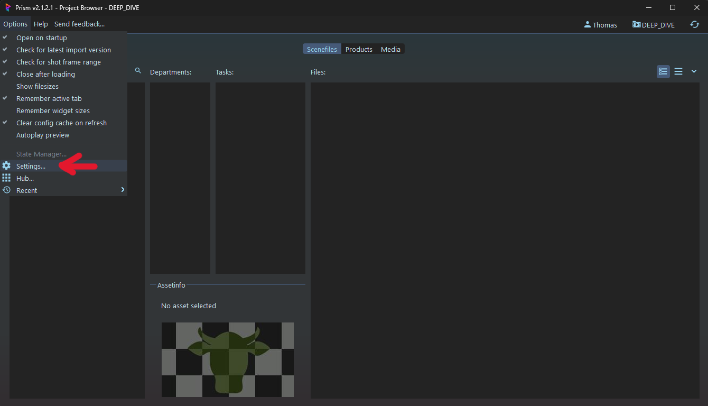
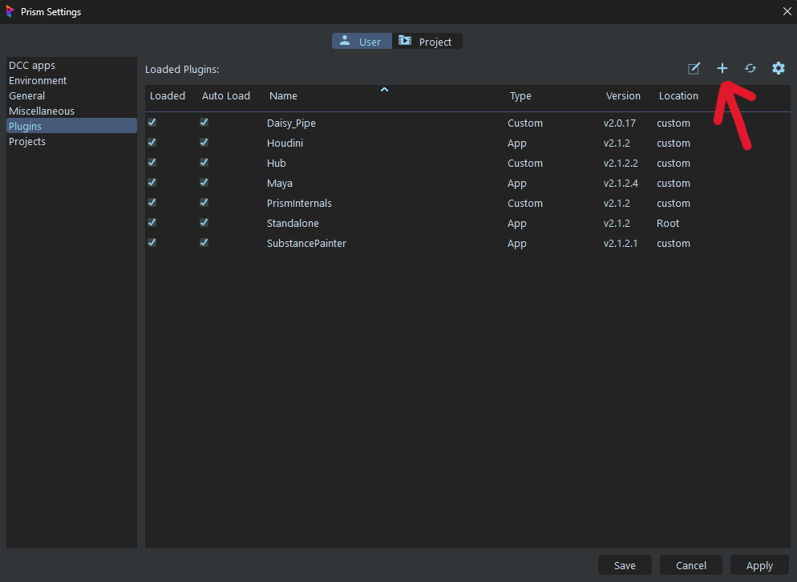
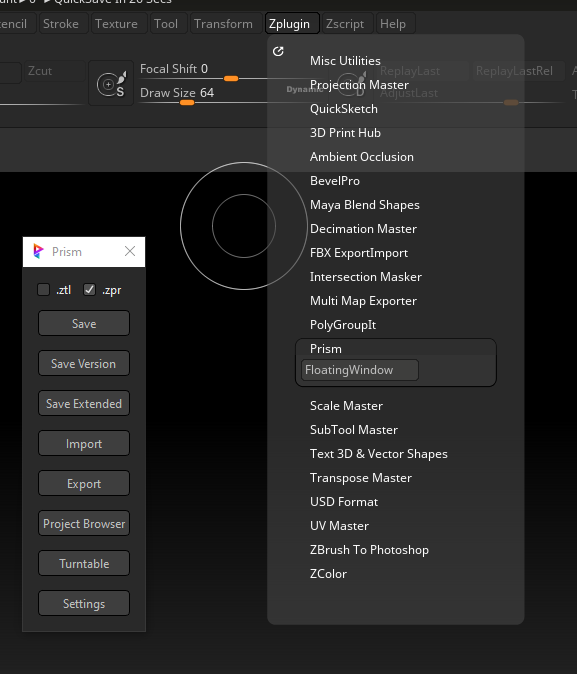

# Zbrush
[< page précédente](README.md)
Cette page sert de documentation pour le plugin Zbrush de Daisy Pipeline. Nous passerons en revue l'installation et l'utilisation du plugin qui sert de lien entre Prism Pipeline et Zbrush 2022. Voici un sommaire pour naviguer sur cette page :

- [Installation](#installation)
    - [Prism](#prism)
    - [Zbrush](#zbrush-1)
- [Utilisation](#utilisation)

***

## Installation
Avant d'ajouter correctement le plugin, assurez-vous d'avoir installé préalable Prism2 (ou Prism) ainsi que Zbrush 2022. Retrouvez ci-dessous le processus d'installation.

Tout d'abbord, récupérez le dossier Zbrush et entrez dedans. Copiez le dossier "**Integration**" dans **C:/Program Files/Pixologic/Zbrush 2022 FL/ZStartup/ZPlugs64**. 
Si vous ne trouvez pas "Pixologic/Zbrush", vous pouvez chercher le dossier "Maxon Zbrush 2022" à la place et reprendre le chemin comme il était à partir de "ZStartup".

Puis copiez le **dossier Zbrush complet** dans **C:/Program Files/Prism2/Plugins/Apps**.

Ensuite vous deverez installer le plugin dans Prism. Mais comment faire ?
Ouvrez Prism, allez dans **Options/Settings**.

Allez dans l'onglet **"Plugins"** et clickez sur le "+" en haut à droite pour ajouter un plugin existant. Finalement allez chercher le dossier Zbrush que vous avez précédemment glissé dans "Apps" avec l'explorateur qui s'ouvre.

Si le plugin ne fonctionne pas dans Zbrush, allez dans "Scripts/Load" et chargez le fichier "**prism_menu.txt**". Zbrush devrait compiler le script à l'intérieur et créer un fichier ".zsc".

***

## Utilisation
L'utilisation du plugin est très simple et très similaire aux autres logiciels utilisant Prism.

### Prism
À l'intérieur de Prism vous pouvez créer un nouveau fichier Zbrush en faisant un **click droit dans la partie "Files"**, puis en choisissant "**Create new version from preset**" et "**Empty scene Zbrush**".

### Zbrush
Dans Zbrush vous pouvez accéder au plugin en allant dans "**Zplugin/Prism/FloatingWindow**". Une fenêtre s'ouvrira avec différentes options.

- cases **.ztl** et **.zpr** : permet de choisir quel extension de fichier Zbrush vous voulez
- **Save**: pour sauvegarder votre fichier (en mettant à jour le versioninfo.json de Prism)
- **Save Version**: pour sauvegarder une nouvelle version
- **Save Extended**: pour sauvegarder une nouvelle version avec des options en plus comme l'ajout d'un commentaire, d'une description et d'une image de preview
- **Import**: pour importer un product Prism
- **Export**: pour exporter en product Prism
- **Project Browser**: pour ouvrir une instance du project browser de Prism dans Zbrush
- **Turntable**: pour faire un turn de votre modèle 3D et le stocker dans les media de Prism
- **Settings**: pour ouvrir les settings de Prism

[< page précédente](README.md) 
*Daisy Pipeline 2026 - by Noa Escourbanies, Leeloo Trinh-Thieu and Thomas Rubio* 
*Zbrush plugin created by Mathieu Carrey (2025) and modified by Thomas Rubio (2026)*